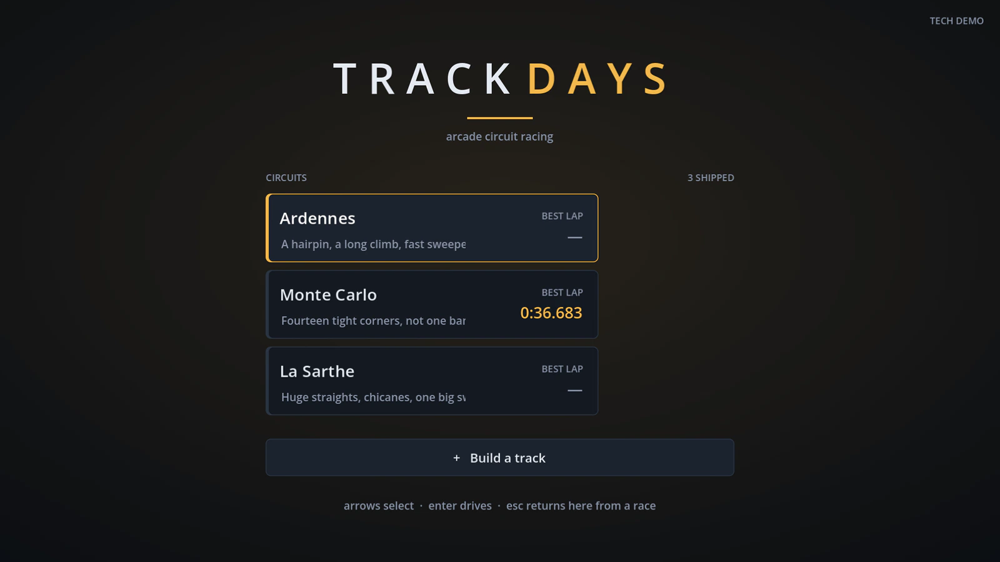
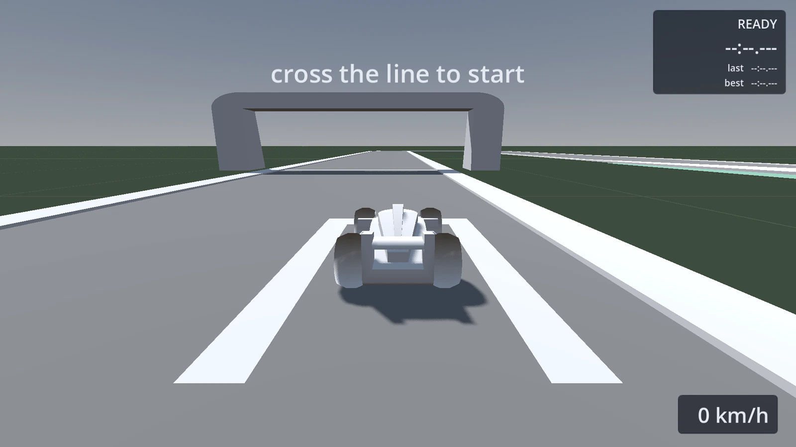
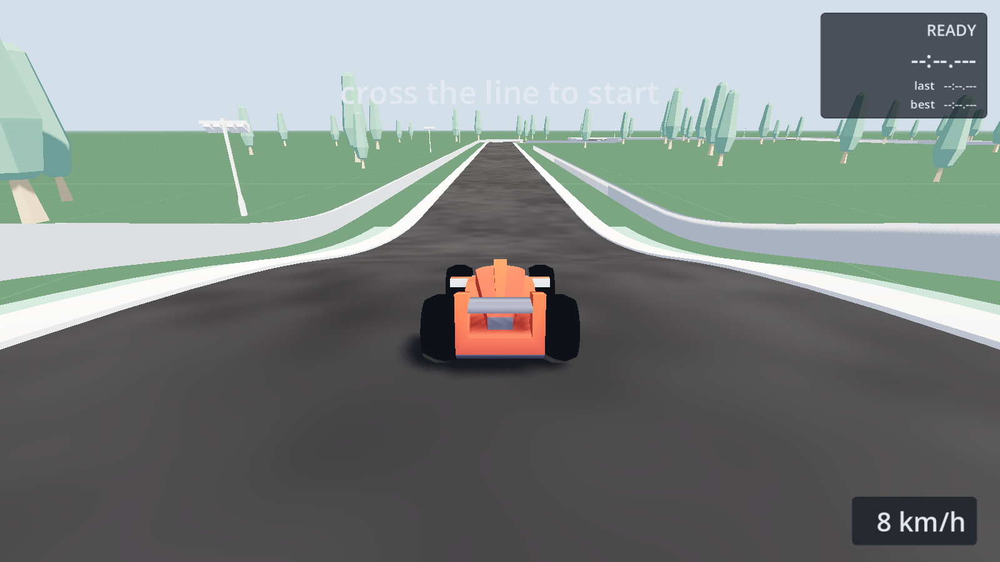
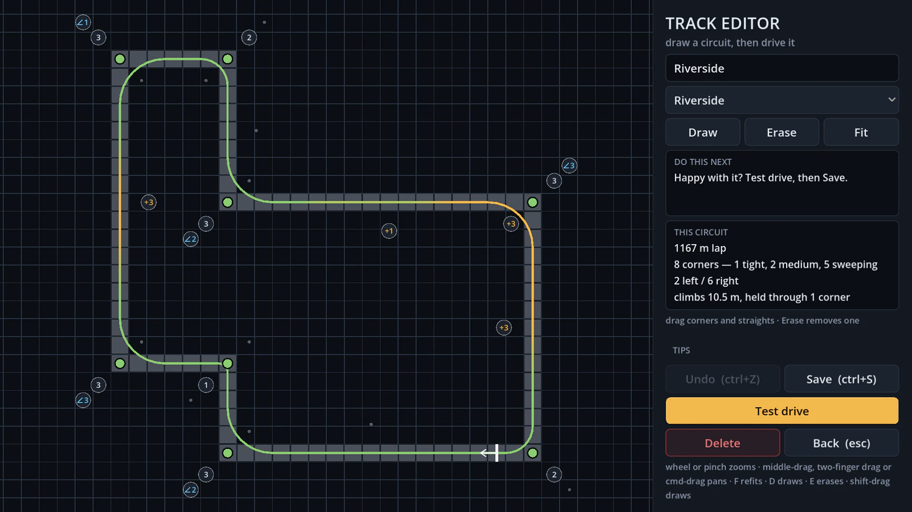
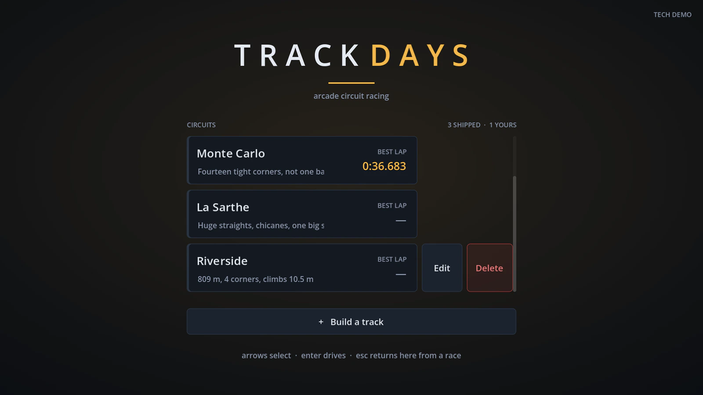

# Track Days

A 3D third-person arcade racer. Pick a circuit, chase a lap time — or draw your
own circuit and chase a time on that.

[](https://github.com/michael-baker-us/track-days/actions/workflows/ci.yml)

**[▶ Play it in your browser](https://michael-baker-us.github.io/track-days/)**



Built in Godot 4.7 and GDScript on the engine's `VehicleBody3D` physics, with
Kenney's CC0 racing and car kits for the art. Everything else — the track builder, the
editor, the lap timing, the UI theme — is written for this project, which was
the point: it is a learning exercise as much as it is a game.

## Driving



Three circuits ship with it, each cut down from a real one to fit a tile set
that only turns in right angles:

| Circuit | Length | Character |
|---|---|---|
| **Ardennes** | 1473 m | Spa's hairpin, a long climb and fast sweepers |
| **Monte Carlo** | 1054 m | Fourteen tight corners, not one of them banked |
| **La Sarthe** | 1768 m | Le Mans' straights, chicanes and one big sweeper |

Handling is tuned to a grippy-arcade target — planted and predictable, sliding
only when provoked. Top speed 165 km/h, 0–100 km/h in 3.5 s, 100–0 in 24 m
(1.6 g), corners held at 98–127 km/h. Every one of those numbers was measured
rather than guessed; [`docs/tuning-journal.md`](docs/tuning-journal.md) records
each sweep, including the ones that were tried and thrown away.



The circuit dresses itself. Barrier, lighting columns, trees and a paddock of
grandstands are all placed from the finished centreline rather than authored per
track, so a circuit drawn in the editor gets the same treatment as a shipped one
— and none of it can end up on the racing line, because every prop is checked
against the whole loop before it goes down.

Laps are timed over sixteen checkpoints that have to be crossed **in order**, so
cutting a corner does not shorten a lap. Best laps are kept per circuit and
survive between sessions. The car starts just behind the line rather than on it,
so timing begins a couple of seconds in instead of after an out lap.

## Building a circuit



The editor is the other half of the game. Draw a circuit freehand, or take the
rectangle a new track opens with and drag its corners and straights into shape.
Either way it compiles to a real track — Kenney tiles, a seamless collision
ribbon and sixteen ordered gates, identical in kind to the shipped circuits.

- **Closure comes free.** A circuit only works if it joins back up; the shipped
  layouts were hand-solved into it. Here every edit is refused unless it leaves
  a single closed loop, so a broken circuit cannot be built in the first place.
- **Corner radius is a choice.** All three Kenney corners join the same two
  centre lines, so the widest that fits is picked automatically and can be
  cycled down — trading straight for a faster corner.
- **Elevation is per segment**, straights and corners alike. Raise a straight on
  its own and you get a crest inside it; raise the corner after it too and the
  height carries on round the bend. Height closes for the same structural reason
  position does, so a hill can never leave the circuit hanging in the air.
- **Banking is per corner**, flat by default, cycling up to 4°. The collision
  surface and the tiles are built from one roll profile, so what you drive is
  what you see.

Circuits are stored as JSON under `user://tracks/`, deliberately not as Godot
resources — a resource file can name a script to attach, which is the wrong
shape for a file players swap with each other.



Your own circuits appear on the title screen alongside the shipped ones, with
their own lap records, an **Edit** button and a **Delete** that asks once before
it fires. Deleting takes the lap record with the track, so the next circuit that
happens to reuse the name cannot inherit a time it never set.

## Controls

| Action | Keyboard | Gamepad |
|---|---|---|
| Steer | <kbd>A</kbd> <kbd>D</kbd> or <kbd>←</kbd> <kbd>→</kbd> | Left stick |
| Accelerate | <kbd>W</kbd> or <kbd>↑</kbd> | Right trigger |
| Brake / reverse | <kbd>S</kbd> or <kbd>↓</kbd> | Left trigger |
| Handbrake | <kbd>Space</kbd> | A |
| Reset car | <kbd>R</kbd> | Y |
| Pause / back | <kbd>Esc</kbd> | B |
| Debug overlay | <kbd>F3</kbd> | — |

On a touchscreen the HUD grows a pair of thumb pads instead. They synthesise
input actions rather than driving the car directly, so there is one set of
controls behind every input device.

### In the editor

Two ways to build, switched with the **Draw** toggle (or <kbd>D</kbd>).

**Draw on** — lay road freehand with a drag, take it away with a right-drag. The
shaping handles hide so a stroke is never mistaken for a drag. Left off a closed
loop? **Join the ends up** routes the last stretch for you.

**Draw off** — drag the loop around by its shape.

| Action | Control |
|---|---|
| Move a corner | Drag a green dot |
| Slide a straight | Drag the road |
| Add a bend | Double-click a straight, then drag it in or out |
| Remove a corner | Right-click a green dot |
| Corner radius | Click the numbered badge outside the loop |
| Raise a straight or corner | Click the badge inside the loop |
| Bank a corner | Click the angle badge outside the loop |
| Move the start line | Drag the flag |
| Lay road without leaving shaping | Shift-drag / shift-right-drag |

Always available: <kbd>Ctrl</kbd>+<kbd>Z</kbd> undo · <kbd>Ctrl</kbd>+<kbd>S</kbd>
save · <kbd>F</kbd> refits the view. Zoom with the wheel or a pinch; pan with a
two-finger drag, a middle-drag, or <kbd>Cmd</kbd>/<kbd>Ctrl</kbd> and drag — a
trackpad has no middle button, so there is a route for each.

## Running it locally

Godot 4.7, no other dependencies. `GODOT` below is the path to the binary.

```bash
GODOT=/path/to/Godot.app/Contents/MacOS/Godot

"$GODOT" --path .                                        # play it
"$GODOT" --headless --path . --script tests/run_tests.gd  # test suite
"$GODOT" --headless --editor --quit --path .              # import / parse check
```

The suite is a hand-rolled `SceneTree` runner staged by physics frame — the
tests are scene- and physics-dependent, so they need a running world rather than
fixtures. Its 689 checks cover tuning invariants, lap ordering, checkpoint
integrity, that the collision surface follows the road's elevation and banking
instead of kinking away from it at a corner, that a painted grid loop compiles
to a circuit the builder agrees closes, and that no shape edit can produce one
that does not. Handling *feel* is not unit-tested; that is what the tuning
journal is for.

CI runs the import, a parse check over every script, and the suite on each push
and pull request.

### Web build

```bash
"$GODOT" --headless --path . --export-release "Web" build/web/index.html
cd build/web && python3 -m http.server 8777   # must be served over HTTP
```

Pushed to GitHub Pages on every merge to `main` — the deploy workflow runs the
suite, exports, and then checks the artifacts actually exist, because Godot's
exporter can print a configuration error and still exit 0.

Two constraints shape the build. It is **single-threaded**, because threading
needs `SharedArrayBuffer` and therefore COOP/COEP headers Pages cannot send; and
web alone uses the **compatibility renderer**, because the browser target is
WebGL 2 while the desktop build stays on Forward+. Godot has quietly dropped the
second of those from `project.godot` more than once, so the test suite asserts
both rather than trusting the file.

## How it's built

```text
scripts/
  car/          VehicleBody3D controller; all feel lives in a CarTuning resource
  camera/       chase camera, framing tuned alongside the handling
  track/        the pipeline: TrackShape -> TrackLayout -> TrackBuilder
                plus checkpoints and the lap tracker
  game/         GameState (static, no autoloads) and the race scene
  ui/           title screen, HUD, pause menu, touch pads, editor and its canvas
tools/          scene builders — every .tscn in the game is generated by one
tests/          the suite
docs/           architecture, tuning journal
```

Four decisions carry most of the weight:

**Feel lives in a resource, not on nodes.** `car.tscn` holds geometry only.
Godot serialises just the non-default properties, so the script defaults *are*
the grippy baseline and each preset stores only its deltas.

**Collision is generated, never taken from the art.** The drivable surface is a
ribbon of quads built along the centreline as one concave shape. The Kenney
tiles are visual; the road you actually drive on is computed from the same
centreline that positions them.

**One builder serves the tool and the game.** `TrackBuilder` is the only thing
that turns a layout into a circuit — it bakes the shipped tracks offline and
builds player circuits at runtime, and the editor runs it without geometry to
get a live readout on every mouse move.

**Generated scenes are committed**, so the game never depends on `tools/` at
runtime, and the tools stay reproducible rather than becoming a one-time
scaffold nobody can re-run.

[`docs/architecture.md`](docs/architecture.md) has the reasoning behind each of
these in full, along with a long list of traps already hit — the owner rule that
once shipped a car with eight wheels, why banked corners are modelled as
embankments, and why the web build must not contain a single character the
built-in font lacks.

## Credits

Art from [Kenney](https://www.kenney.nl)'s Racing Kit and Car Kit, both CC0.
Built with [Godot](https://godotengine.org).
